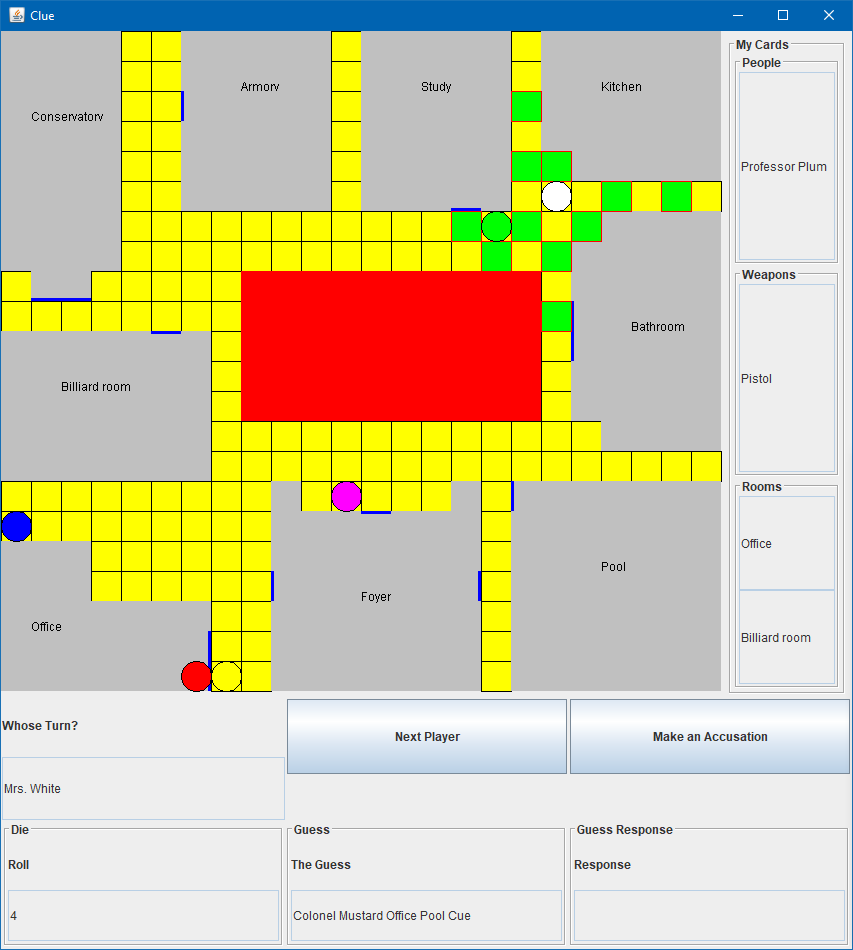
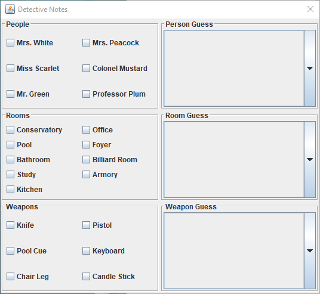
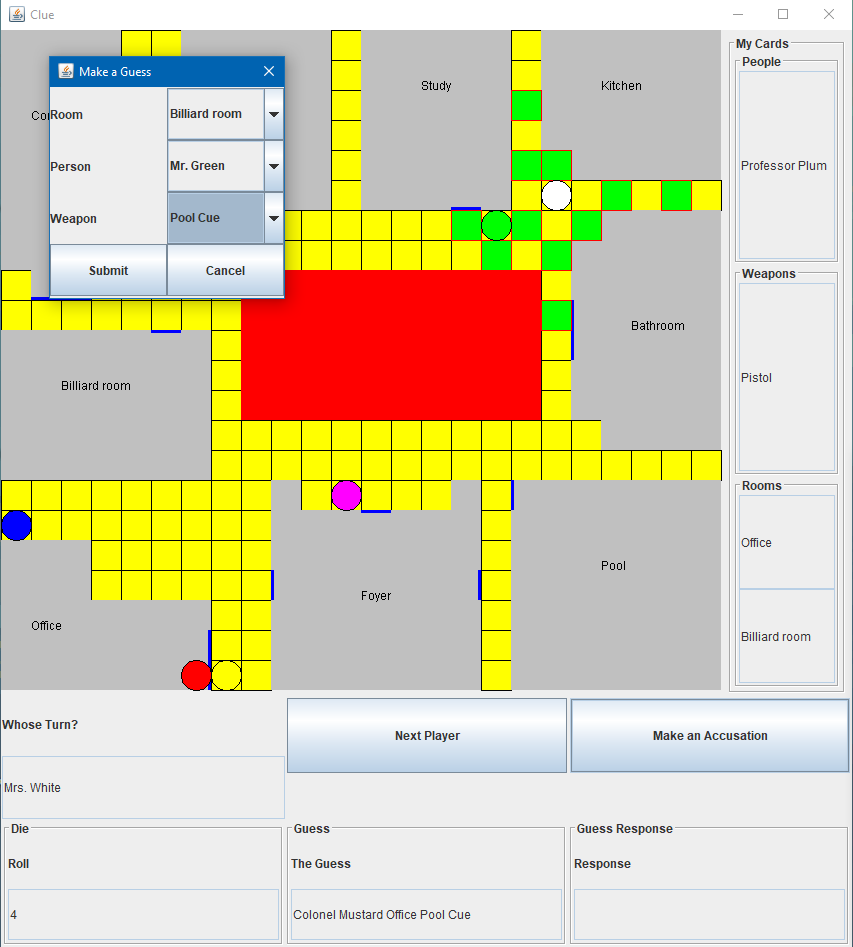

# Clue

A playable game of clue (akin to the classic board game), written in Java. Features all of the functionality of the original game. Make accusations, guesses, and play against the computer to find the perp!

## UI

The game board, players, and possible moves (highlighted green) tiles are shown in the game UI. Clicking on one of the highlighted tiles allows players to move to the spot during their turn.

These are the detective notes used for the game, if you can't remember all the guesses and accusations being made throughout the course of the game.

The UI when making an accusation, which can win you the game if you're correct.
